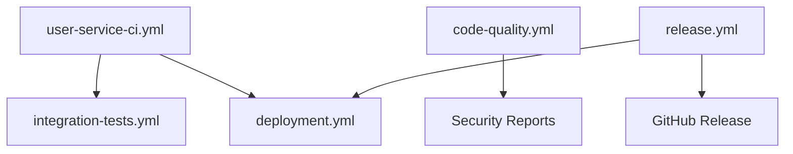

# GitHub Actions Workflows Documentation

This document describes the comprehensive CI/CD pipeline for the DocuTrace User Service.

## Workflow Overview

The project includes 5 main workflow files that provide complete automation for development, testing, security, deployment, and release management.

### 1. User Service CI (`user-service-ci.yml`)

**Triggers:**
- Push to any branch
- Pull requests to main/develop
- Manual dispatch

**Stages:**
1. **Build & Test**
   - Java 17 compilation
   - Unit tests with JaCoCo coverage
   - Test report generation

2. **Code Quality**
   - Checkstyle code style validation
   - PMD static analysis
   - SpotBugs vulnerability detection

3. **Security Scanning**
   - OWASP dependency check
   - Trivy container vulnerability scanning
   - Secret scanning with TruffleHog

4. **Docker Build**
   - Multi-stage Docker build
   - Image tagging and metadata
   - Registry push (GHCR)

5. **Integration Testing**
   - PostgreSQL and Redis services
   - Flyway database migrations
   - Newman API testing

6. **Deployment (Conditional)**
   - Staging deployment for main branch
   - Production deployment for production branch

### 2. Code Quality & Security (`code-quality.yml`)

**Triggers:**
- Push to main/develop/feature branches
- Pull requests
- Weekly scheduled runs (Sundays 3 AM UTC)
- Manual dispatch

**Jobs:**
- **Code Quality Analysis**: Checkstyle, PMD, SpotBugs, JaCoCo
- **SonarCloud Analysis**: Code quality metrics and security hotspots
- **Security Vulnerability Scanning**: OWASP dependency check
- **CodeQL Analysis**: GitHub's semantic code analysis
- **License Compliance**: License scanning and reporting
- **Docker Security**: Trivy container scanning
- **Secret Scanning**: TruffleHog for exposed secrets
- **Security Report**: Consolidated security findings

### 3. Integration Tests (`integration-tests.yml`)

**Triggers:**
- Manual dispatch
- Called by other workflows
- Scheduled runs

**Features:**
- **Cross-Service Testing**: Multi-service integration validation
- **Performance Testing**: k6 load testing scenarios
- **Infrastructure Deployment**: Kind cluster with PostgreSQL/Redis
- **Environment Matrix**: Testing across multiple configurations
- **Comprehensive Reporting**: Test results, performance metrics, logs

### 4. Deployment (`deployment.yml`)

**Triggers:**
- Push to main branch
- Merged pull requests
- Manual dispatch with environment selection

**Environments:**
- **Staging**: Automatic deployment from main branch
- **Production**: Manual deployment with approval gates

**Features:**
- **Blue-Green Deployment**: Zero-downtime production deployments
- **Database Migrations**: Automated Flyway migration execution
- **Smoke Testing**: Post-deployment health verification
- **Rollback Capability**: Automatic rollback on failure
- **Slack Notifications**: Deployment status updates

### 5. Release (`release.yml`)

**Triggers:**
- Git tags (v*.*.*)
- Manual dispatch with version input

**Process:**
1. **Validation**: Version format and tag existence checks
2. **Build**: JAR and Docker image creation with versioning
3. **Security Scan**: Vulnerability assessment of release artifacts
4. **Release Notes**: Automated changelog generation
5. **GitHub Release**: Asset upload and release creation
6. **Deployment**: Automatic staging deployment for stable releases
7. **Notifications**: Slack alerts for release status

## Workflow Dependencies



## Required Secrets

### GitHub Secrets
- `SONAR_TOKEN`: SonarCloud authentication
- `DOCKER_HUB_TOKEN`: Docker Hub API access
- `STAGING_KUBECONFIG`: Staging Kubernetes configuration
- `PRODUCTION_KUBECONFIG`: Production Kubernetes configuration
- `SLACK_WEBHOOK_URL`: Slack notifications
- `DEPLOYMENT_TRACKER_URL`: Deployment tracking system
- `DEPLOYMENT_TRACKER_TOKEN`: Deployment tracker authentication

### Environment Variables
- `APP_JWT_PRIVATE_KEY`: JWT signing private key
- `APP_JWT_PUBLIC_KEY`: JWT verification public key
- `APP_SECURITY_REFRESH_SECRET`: Refresh token HMAC secret
- `APP_SECURITY_MAGIC_SECRET`: Magic token HMAC secret
- `DATABASE_URL`: PostgreSQL connection string
- `REDIS_URL`: Redis connection string

## Artifact Management

### Build Artifacts
- **JAR Files**: Application executable with version tagging
- **Docker Images**: Multi-architecture images (AMD64, ARM64)
- **Test Reports**: JUnit XML, JaCoCo coverage, security scans
- **SBOM**: Software Bill of Materials for security tracking

### Retention Policies
- **Test Reports**: 7 days
- **Security Scans**: 30 days
- **Release Artifacts**: 90 days
- **Docker Images**: Tagged by version, latest for stable releases

## Quality Gates

### Code Quality Thresholds
- **Test Coverage**: Minimum 80% line coverage
- **Security**: No HIGH/CRITICAL vulnerabilities in dependencies
- **Code Style**: Zero Checkstyle violations
- **License Compliance**: All dependencies must have approved licenses

### Deployment Gates
- **Staging**: Automatic for main branch after all checks pass
- **Production**: Manual approval + successful staging deployment
- **Rollback**: Automatic on health check failures

## Monitoring and Observability

### Health Checks
- **Application**: Spring Boot Actuator endpoints
- **Database**: Connection and migration status
- **External Services**: Redis connectivity

### Performance Monitoring
- **Load Testing**: k6 scenarios for API endpoints
- **Resource Usage**: Container metrics and limits
- **Response Times**: 95th percentile under 500ms

### Alerting
- **Deployment Failures**: Immediate Slack notifications
- **Security Issues**: Weekly security scan summaries
- **Performance Degradation**: Load test failure alerts

## Maintenance

### Regular Tasks
- **Dependency Updates**: Weekly automated PRs for security patches
- **Image Updates**: Monthly base image updates
- **Cleanup**: Automated artifact cleanup based on retention policies

### Security Practices
- **Secret Rotation**: Quarterly secret rotation reminders
- **Vulnerability Scanning**: Weekly automated scans
- **License Audits**: Monthly license compliance reviews

## Usage Examples

### Manual Deployment
```bash
# Deploy specific version to staging
gh workflow run deployment.yml -f environment=staging -f version=v1.2.3

# Deploy to production (requires approval)
gh workflow run deployment.yml -f environment=production -f version=v1.2.3
```

### Creating a Release
```bash
# Create and push a tag (triggers automatic release)
git tag -a v1.2.3 -m "Release v1.2.3"
git push origin v1.2.3

# Or use manual workflow dispatch
gh workflow run release.yml -f version=v1.2.3 -f prerelease=false
```

### Running Integration Tests
```bash
# Run full integration test suite
gh workflow run integration-tests.yml

# Run with specific environment
gh workflow run integration-tests.yml -f environment=staging
```

## Troubleshooting

### Common Issues

1. **Build Failures**
   - Check Java version compatibility
   - Verify Maven dependencies
   - Review test failures in artifacts

2. **Deployment Issues**
   - Validate Kubernetes configurations
   - Check secret availability
   - Verify database migration compatibility

3. **Security Scan Failures**
   - Review dependency vulnerabilities
   - Check for exposed secrets
   - Validate container base image security

### Debug Commands
```bash
# View workflow runs
gh run list --workflow=user-service-ci.yml

# Download artifacts
gh run download <run-id>

# View logs
gh run view <run-id> --log
```

## Best Practices

### Development Workflow
1. Create feature branch from develop
2. Push commits trigger CI checks
3. Create PR to develop/main
4. Merge after all checks pass
5. Tag for release when ready

### Security Guidelines
- Never commit secrets to repository
- Use environment variables for sensitive data
- Regularly update dependencies
- Monitor security scan results

### Performance Optimization
- Use build caches effectively
- Optimize Docker layers
- Parallel job execution where possible
- Artifact size optimization

This CI/CD pipeline provides comprehensive automation while maintaining security, quality, and reliability standards for the DocuTrace User Service.
